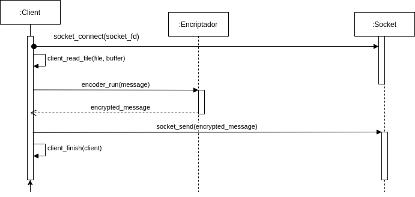

# CRYPTO SOCKETS #
- - - -
## INFORME ##

CryptoSockets es un proyecto compuesto de dos aplicaciones que permite encriptar y desencriptar mensajes utilizando los metodos conocidos como ***Cesar***, ***Vigenere*** y ***Rivest Cipher 4*** o ***RC4***.  
Las aplicaciones que componen este proyecto, en terminos generales, son:  
- **CLIENT** es la encargada de recibir el mensaje desde un archivo, encriptarlo y enviarlo encriptado a algun servidor por medio de sockets TCP.  
Su invocacion se hace por medio del comando   
>```./client <server-host> <server-port> --method=<method> --key=<key> ```   

en donde ```<server-host>``` y ```<server-port>``` indican la maquina y el puerto al que se debe conectar para enviar el mensaje, ```--method``` es el metodo de encriptacion y ```--key``` es la clave secreta que necesita el metodo para encriptar. 
- **SERVER** es la encargada de recibir el mensaje encriptado por medio un socket TCP, desencriptarlo y mostrarlos por salida estandar.
Su invocacion en similar a la de CLIENT, con la diferencia que para la conexion solo se le indica el puerto  
>```./server <server-port> --method=<method> --key=<key> ```   
 

> ## Metodos de encriptacion o cifrado ##
Como se menciono al principio, CryptoSockets acepta 3 metodos de encriptacion:
- Cifrado de CESAR  

El cifrado de Cesar es una de las técnicas de cifrado más simples y más usadas. Es un tipo de cifrado por sustitución en el que una letra en el texto original es reemplazada por otra letra que se encuentra un número fijo de posiciones más adelante en el alfabeto. En este caso, el numero de posiciones es la clave (``` --key``` ) que se le pasa al programa en su invocacion. 
Por ejemplo, si tengo una letra "A" y la clave es 5, entonces el resultado de encriptacion es "F"

- Cifrado de VIGENERE  

El cifrado de Vigenere es una ampliacion del metodo de Cesar. Aqui, la suma se hace con el valor en ASCII de la letra correspondiente a la posicion iterada de la clave.

- Cifrado de RIVEST CYPHER 4  

El cifrado de Rivest Cyhper 4 (o conocido tambien como RC4) es el mas complejo de los metodos soportados por este proyecto. Consiste basicamente de dos algoritmos, KSA (Key Scheduling Algorithm) y  PRGA (Pseudo-Random Generation Algorithm). En KSA, se genera un vector producto de operaciones entre la clave y un vector con los 256 caracteres de ASCII. Una vez obtenido dicho vector, se procede a PRGA, en donde se realiza operaciones de XOR entre el mensaje y el vector generado, luego de algunas operaciones de suma y swapeo.


> ## Metodos de comunicacion ##
CryptoSockets utiliza el protocolo TCP por medio sockets POSIX para realizar las comunicaciones entre CLIENT y SERVER. El programa CLIENT esta diseñado para enviar los mensajes encriptados por medio del uso de sockets a alguna maquina para que los procese. El programa SERVER, por su parte, esta preparado para recibir por medio de sockets mensajes encriptados con alguno de estos metodos mencionados y desencriptarlos.


> ## Diseño ##
